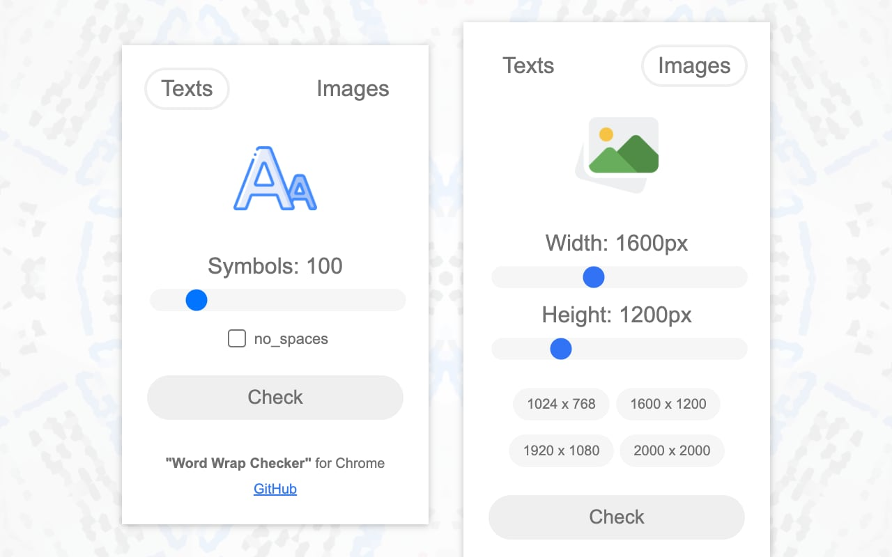

# Word Wrap Checker Extension

With this [extension](https://chrome.google.com/webstore/detail/word-wrap-checker/gjkiifeaanbafelffgfpdkhbcekmlcad), you can quickly test different layouts and spot issues related to long words, phrases, or big images.

## How to use it?

1. Open Google Chrome.
2. Install the [Word Wrap Checker](https://chrome.google.com/webstore/detail/word-wrap-checker/gjkiifeaanbafelffgfpdkhbcekmlcad) extension.
3. Open any website.
4. Click on the extension's button.
5. Adjust the parameters and click on the "Check" button.

To reset all changes, refresh the page.

## Acknowledgments

- Daniil [@Daniel217D](https://github.com/Daniel217D)

## Contributing

Feel free to contribute! 😉

If you have ideas or improvements for this tool, you can create a [pull request](https://github.com/nikbelikov/word-wrap-checker/pulls) to submit your changes.
